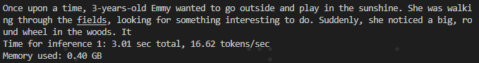

# llm_test
 
Most of codes borrow from [litgpt](https://github.com/Lightning-AI/litgpt).

Test demo with Infini-Transformer \ MOE \ MOD \ Mamba ...etc  
 
Easy to compare with each other. Support deepspeed v2 v3 or fsdp.

see [`model_v2.py`](litgpt/model_v2.py) and [`config_v2.py`](litgpt/config_v2.py) for details.

Demo result:

| Base Model             | Epochs | max seq len | segment len | datasets    |  params   |  val loss   |
|------------------------|--------|-------------|-------------|-------------|-----------|-------------|
| Llama2                 | 10     | 256         | /           | tinystories |  15+M     | 1.127       |
| Mamba                  | 10     | 256         | /           | tinystories |  12+M     | 1.13       |
| Infini-Llama2          | 10     | 512         | 256         | tinystories |  15+M     | 1.16        |
| Infini-Llama2-MOE 4/2  | 10     | 512         | 256         | tinystories |  27+M     | 1.05        |

Demo respond with Infini-Llama2-MOE 4/2:  

